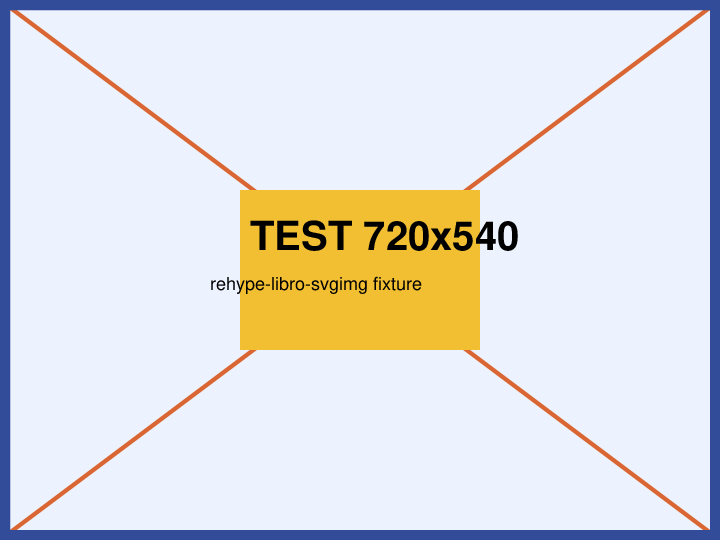

# svgimg 照合用フィクスチャ

参照画像: `sample.png` = 720×540px。
印刷サイズ printW = 720×25.4/72 = **254mm**、printH = 540×25.4/72 = **190.5mm**（端数なし）。
書式: `?svgimg=倍率,横幅mm,高さmm,横シフト量mm,縦シフト量mm`（倍率以外は省略可。幅高さ省略時なりゆき、シフト0）。
各 `<!-- -->` は移植版／原実装が出力すべき `<svg>` の期待値（照合の正解）。コメントは両実装とも非対象。

## 正常系（移植版・原実装で出力一致するはず）

### 1. 倍率のみ

<!-- svg 101.6mm×76.2mm / viewBox 0 0 101.6 76.2 / image 254×190.5 / translate(0,0) scale(0.4) -->

### 2. 倍率のみ（README の縮小例と同率）

<!-- svg 76.2mm×57.15mm / viewBox 0 0 76.2 57.15 / image 254×190.5 / translate(0,0) scale(0.3) -->

### 3. 倍率＋横幅（高さなりゆき）

<!-- svg 180mm×57.15mm / viewBox 0 0 180 57.15 / image 254×190.5 / translate(0,0) scale(0.3) -->

### 4. 倍率＋横幅＋高さ

<!-- svg 180mm×200mm / viewBox 0 0 180 200 / image 254×190.5 / translate(0,0) scale(0.3) -->

### 5. フル指定（README の例 `30,180,200,-10,-10`）

<!-- svg 180mm×200mm / viewBox 0 0 180 200 / image 254×190.5 / translate(-10,-10) scale(0.3) -->

### 6. 中間フィールド省略（幅高さ空・シフトのみ指定）

<!-- 空フィールドは 0 扱い→なりゆき。svg 127mm×95.25mm / viewBox 0 0 127 95.25 / image 254×190.5 / translate(5,5) scale(0.5) -->

### 7. 小数倍率（round3 の丸め確認）

<!-- newscale=0.333。scaleH=190.5×0.333 は IEEE-754 で 63.43649…（厳密な 63.4365 ではない）→round3=63.436。svg 84.582mm×63.436mm / viewBox 0 0 84.582 63.436 / image 254×190.5 / translate(0,0) scale(0.333) -->

### 8. alt テキストあり（alt は figcaption 化されない）

<!-- ケース1と同一の svg を出力。原実装は  全体を svg に置換し、VFM の img→figure+figcaption 化を先回りで潰すため alt は出力に残らない（alt を個別に削除しているわけではない） -->

## 対照群（変換対象外＝`` のまま残るはず）

### 9. svgimg クエリなし

<!-- 非変換 -->

### 10. 別クエリのみ（svgimg を含まない）

<!-- 非変換。移植・原実装とも "?svgimg=" を含まない（indexOf=-1） -->
